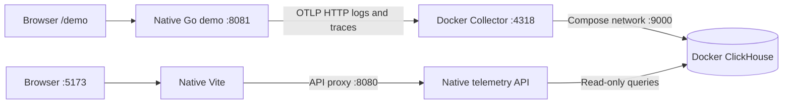

# Local development implementation plan

Status: local workflow implemented. See [the development guide](../dev/README.md)
for commands and [API.md](API.md) for the shipped contracts. Production work
remains tracked separately in [PLAN.md](PLAN.md).

## Goal and architecture

Trigger an action in Go demo and inspect real traces and correlated logs in
Signal Deck. Use only two containers; develop both Go apps and the frontend
natively, without Kubernetes or the platform deployment stack.

The Collector is the only ingestion endpoint. The telemetry API never ingests
OTLP, and the browser never connects directly to ClickHouse. Every host port
binds to loopback in the local workflow.

## Milestone 1: dependency environment

- [x] Add `code/apps/compose.yaml` with exactly ClickHouse and Collector.
- [x] Reuse platform image pins: Altinity `26.3.33.10001.altinitystable` and
  Collector Contrib `0.160.0`.
- [x] Persist ClickHouse data in a named volume and rotate container logs.
- [x] Configure local ingest and SELECT-only API users.
- [x] Allow the read-only driver's timeout settings while denying writes.
- [x] Configure bounded exporter queues, retries, memory, and 24-hour retention.
- [x] Stamp `tenant.id=local` and the local deployment environment on both signals.
- [x] Use only logs/traces pipelines; omit metrics and stdout tailing.
- [x] Verify live schema: resource maps, Server/Internal span kinds, Error/Unset
  status values, nanosecond durations, and trace/log IDs.

Files: `compose.yaml`, `dev/clickhouse-users.xml`, `dev/otel-collector.yaml`.

## Milestone 2: real Go demo telemetry

- [x] Add trace and log SDKs, OTLP HTTP exporters, and a compatible slog bridge.
- [x] Preserve JSON stdout logging and standalone operation without an endpoint.
- [x] Instrument requests, attach route/status, and exclude health probes.
- [x] Add work spans and context-aware logs with matching trace/span IDs.
- [x] Sample all local requests and flush providers on shutdown.
- [x] Preserve the greeting at `/` and add `/demo` with action buttons.
- [x] Return server-generated trace IDs and links to UI trace details.
- [x] Make exporter outages independent of demo response success.

| Action | Endpoint | Expected result |
| --- | --- | --- |
| Success | `POST /demo/success` | 200, request/work spans, info log |
| Slow | `POST /demo/slow` | 200, roughly 500 ms work span, warning log |
| Error | `POST /demo/error` | Intentional 500, error spans and error log |

Files: `go-demo/main.go`, `demo.go`, `telemetry.go`, module files, tests.

## Milestone 3: ClickHouse-backed API

- [x] Add the official Go client behind a query-store interface.
- [x] Implement services, trace RED, trace lists/details, log volume, and logs.
- [x] Keep authorization and tenant predicates on all queries.
- [x] Parameterize values and reject invalid IDs, severities, limits, and ranges.
- [x] Default to 30 minutes; cap at 24 hours and 500 records per request.
- [x] Bound query concurrency, queue wait, execution time, and memory.
- [x] Preserve timestamp precision and client cancellation.
- [x] Gap-fill one-minute counts, keep missing latency null, label partial buckets.
- [x] Compute RED from server spans and whole-range percentiles from raw spans.
- [x] Return explicit storage failures instead of successful empty results.
- [x] Keep API self-export off in the local launcher.
- [x] Add readiness based on database/table access.

Implementation decision: start with bounded offset pagination (maximum offset
5000), stable ordering, a fixed time window while paging, and explicit truncation.
A cursor is not necessary for the small local development dataset; late arrivals
can shift page boundaries. The initial environment is fixed to local in the UI.

Files: `backend/queries.go`, `main.go`, tests, module files, `API.md`.

## Milestone 4: usable UI

- [x] Replace placeholder charts with live data and RED summary cards.
- [x] Add trace/request lists, span timing, attributes, and correlated logs.
- [x] Link logs to traces and trace details to filtered logs.
- [x] Add service/window/status/duration/severity filters stored in the URL.
- [x] Default to Go demo and the last 30 minutes.
- [x] Poll every two seconds while visible; support pause/manual refresh.
- [x] Cancel obsolete requests and avoid overlapping scheduled refreshes.
- [x] Limit browser query concurrency so trace details fit the API budget.
- [x] Show loading, empty, failed, partial, and truncated states.
- [x] Provide keyboard controls and tabular chart values.

Files: `frontend/src/pages/logs`, `pages/traces`, `pages/_shared/telemetry`, matching `routes/*/index.tsx`, and `layouts`. Styling uses Tailwind with shared theme tokens.

## Milestone 5: native lifecycle

- [x] Add `task dev:setup`, `dev`, `dev:stop`, `dev:status`, `dev:reset`.
- [x] Add native `dev:test`, live `dev:integration`, and `dev:smoke` checks.
- [x] Start healthy dependencies before exposing the frontend.
- [x] Detect port conflicts without killing existing processes.
- [x] Supervise owned process groups; bound shutdown and flush exporters first.
- [x] Preserve dependencies that were already running before the supervisor.
- [x] Rebuild/restart Go apps on source/module changes; retain a working binary
  if a rebuild fails. Vite supplies frontend hot reload.
- [x] Keep build products and logs in ignored `dev/.runtime`.
- [x] Preserve existing platform deployment tasks.

Files: `code/apps/Taskfile.yml`, `dev/manage.py`, `dev/.gitignore`, app READMEs.

## Verification

- [x] Native Go tests/vet and frontend production build/typecheck.
- [x] Unit coverage for parented error spans, contextual logs, disabled export,
  health exclusion, filter validation, tenant predicates, and gap filling.
- [x] Live database tests for read-only permissions, cross-tenant trace/log
  isolation, timestamp boundaries, and query cancellation.
- [x] Smoke requests produce two spans and two correlated logs each, with
  expected error/slow behavior and matching IDs. First successful run measured
  about 2–3 seconds to visibility; smoke checks use a 15-second deadline.
- [x] Browser verification of trace details, correlated logs, severity filters,
  and demo actions; no browser telemetry SDK added.
- [x] Stop/restart ClickHouse: API returns 503 during the outage, the demo
  remains responsive, queued telemetry recovers, and existing history persists.
- [x] Verify Colima allocation: 4 CPUs and 6 GiB RAM.
- [x] Confirm only two containers are running and no cluster is contacted.

Local resource limits are 2 GiB/two CPUs for ClickHouse and 256 MiB/one CPU for
Collector. A light-load sample was approximately 624 MiB and 216 MiB respectively;
this excludes Docker VM overhead and native processes and is not a minimum-spec claim.

## Follow-up scope

These are extensions, not prerequisites for the local request-to-telemetry loop:

- Cursor pagination for larger streams and broader telemetry navigation.
- Query performance measurements under sustained load and longer outage testing.
- Production OIDC, trusted tenant assignment, rate limits, migrations, deployment,
  and observability of the telemetry backend, as described in `PLAN.md`.

The local identity and disposable passwords must remain local-development settings.
Collector retention is asynchronous, and queues are not durable across crashes.
