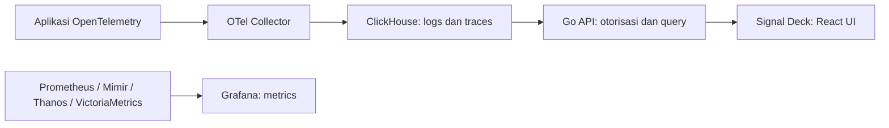

# Proposal Signal Deck: Logs dan Traces di Atas ClickHouse

**Signal Deck (`telemetry-ui`) membantu mencari logs dan traces untuk troubleshooting dengan mudah, murah, dan performant.** Fokusnya: UI ringkas, pencarian responsif, dan biaya observability terkendali saat volume data tumbuh.

Status: proposal produk dengan fondasi aplikasi lokal. · 26 September 2026.

## Mengapa dibuat?

- **Performa dan storage:** pada penggunaan yang melatarbelakangi ide ini, Loki/Tempo dirasakan kurang responsif dan konsumsi storage meningkat. Loki sensitif terhadap desain label/cardinality; Tempo bergantung pada pembacaan block, cache, dan kolom Parquet. ClickHouse menjadi kandidat untuk memperbaiki rasio biaya/performa, dengan pembuktian melalui benchmark. [Loki](https://grafana.com/docs/loki/latest/get-started/labels/), [Tempo](https://grafana.com/docs/tempo/latest/reference-tempo-architecture/object-storage/).
- **Pengalaman investigasi:** tampilan Grafana dirasakan terlalu besar untuk membaca banyak log/span. UI khusus dapat menyediakan baris padat, filter terpadu, trace waterfall, korelasi log–trace, dan URL investigasi yang bisa dibagikan.
- **Pemanfaatan ClickHouse:** Grafana sudah memiliki query builder ClickHouse. Peluang Signal Deck adalah workflow troubleshooting yang lebih terarah, terintegrasi dengan platform, dan dioptimalkan untuk kebutuhan tim. [Plugin ClickHouse](https://grafana.com/docs/plugins/grafana-clickhouse-datasource/latest/query-editor/).
- **Scope realistis:** pencarian, detail span, waterfall, korelasi, dan ringkasan request/error/latency lebih terbatas daripada membangun platform metrics lengkap. Trace besar, span terlambat/hilang, dan hasil terpotong tetap perlu ditangani.

## Potensi kompresi 10×

Studi kasus Clever dari ClickHouse melaporkan **kompresi 10× pada logs 150 TB/bulan**. Angka ini merupakan laporan vendor atas workload pelanggan, bukan hasil benchmark Signal Deck. [Sumber](https://clickhouse.com/blog/clever-observability-at-scale).

Ilustrasi satu salinan data: **1 TB mentah/hari × 30 hari = 30 TB → sekitar 3 TB pada kompresi 10×**. Pada 5× menjadi 6 TB; pada 15× menjadi 2 TB.

Kompresi 10× berarti pengurangan payload sekitar 90% terhadap data mentah, **bukan penghematan tagihan 90% atau 10× lebih hemat dari Loki/Tempo**. Loki juga memakai kompresi dan Tempo memakai Parquet. Biaya aktual mencakup replika, indeks, materialized views, backup, merge, compute, jaringan, dan operasional. Rasio bergantung pada struktur data, sorting key, dan codec. [Storage Loki](https://grafana.com/docs/loki/latest/operations/storage/), [Format Tempo](https://grafana.com/docs/tempo/latest/reference-tempo-architecture/block-format/).

Manfaat yang dituju: retensi lebih panjang, lebih banyak data untuk investigasi, serta biaya layanan dan harga jual yang kompetitif.

## Produk dan arsitektur

Alur utama: **pilih service dan waktu → filter error/durasi/atribut → buka trace → lihat log terkait**. API memvalidasi tenant, izin, dan batas query; kredensial database tetap di server. Ingestion melalui Collector.

Fondasi lokal tersedia: Go + React/TypeScript, pencarian logs/traces, detail span, korelasi, ringkasan request/error/latency, filter atribut/JSON, dan SQL preview. Autentikasi masih lokal; OIDC, tenant produksi, audit, dan uji skala besar belum selesai. Pencarian masih memakai scan berbatas budget sehingga schema/indeks perlu tuning sesuai workload. [README](README.md), [API](API.md).

## Kompetitor dan pembeda

| Alternatif | Posisi terhadap Signal Deck |
| --- | --- |
| **Datadog** | Observability terintegrasi: APM, logs, metrics, dan korelasi. Pembanding pengalaman produk serta biaya layanan. [Datadog APM](https://www.datadoghq.com/product/apm/) |
| **ClickStack — resmi ClickHouse** | Stack open source dengan UI HyperDX untuk logs, traces, metrics, dan sessions. Kompetitor terdekat secara arsitektur. [ClickStack](https://github.com/ClickHouse/ClickStack) |
| **Grafana + Loki/Tempo** | Baseline perbandingan biaya, performa, dan workflow investigasi. [Loki](https://grafana.com/docs/loki/latest/operations/storage/), [Tempo](https://grafana.com/docs/tempo/latest/reference-tempo-architecture/object-storage/) |
| **Grafana + ClickHouse** | Query builder dan visualisasi siap tersedia; alternatif dengan perubahan stack lebih sedikit. [Plugin](https://grafana.com/docs/plugins/grafana-clickhouse-datasource/latest/query-editor/) |

Pembeda yang perlu dibuktikan: **UI lebih ringkas, integrasi platform internal, onboarding BYO ClickHouse, serta kontrol biaya dan akses**. ClickHouse saja belum cukup menjadi pembeda. Jika alternatif memenuhi kebutuhan dengan biaya total lebih rendah, adopsi/integrasi tetap layak.

## Metrics: alternatif Mimir

Metrics tetap memakai Grafana dengan backend pilihan tim; migrasinya terpisah dari MVP logs/traces.

- **Thanos:** memperluas Prometheus; sidecar menyediakan akses query dan mengunggah block ke object storage untuk retensi panjang. Cocok dievaluasi untuk mempertahankan deployment Prometheus yang ada. [Thanos](https://thanos.io/tip/components/sidecar.md/).
- **VictoriaMetrics:** database time series single-node/cluster dengan API query kompatibel Prometheus dan MetricsQL. Alternatif backend metrics yang perlu diuji berdasarkan volume, retensi, dan biaya resource. [Dokumentasi](https://docs.victoriametrics.com/victoriametrics/).

Keduanya dapat menggantikan peran Mimir sesuai kebutuhan, tetapi migrasi perlu memeriksa remote write, dashboard, rules, tenant, retensi, dan data historis. MetricsQL memiliki perbedaan semantik dengan PromQL. Benchmark metrics dilakukan tersendiri. [MetricsQL](https://docs.victoriametrics.com/MetricsQL.html).

## Monetisasi

Target: tim platform, SRE, dan backend pengguna OpenTelemetry dengan volume telemetry yang meningkat.

| Penawaran | Pendapatan |
| --- | --- |
| **BYO ClickHouse:** UI di atas data pelanggan | Langganan per deployment/organisasi |
| **Managed service:** ingestion, retensi, upgrade, kapasitas | Langganan dasar + ingest mentah + retensi tambahan; kuota query jelas |
| **Enterprise self-hosted:** SSO, RBAC, audit, SLA | Lisensi tahunan + support; fitur enterprise masih roadmap |
| **Migrasi dan optimasi:** Collector, schema, tuning | Biaya implementasi/jasa |

Mulai dari **pilot berbayar BYO ClickHouse + onboarding**; managed service menyusul setelah biaya terukur. Pelanggan mendapat potensi penghematan infrastruktur dan waktu investigasi. Penyedia mendapat peluang pendapatan berulang serta margin lebih baik dari efisiensi storage/query.

Ilustrasi internal: pendapatan Rp10 juta/bulan dengan biaya langsung Rp4 juta menghasilkan margin kotor 60%; biaya turun ke Rp3 juta menghasilkan 70%. Belum termasuk R&D, penjualan, dan biaya perusahaan. Harga harus menutup ingest, storage/replika/backup, compute, jaringan, serta support.

## Validasi dan keputusan

1. **Pilot internal:** pipeline paralel, data representatif, ukur kualitas korelasi dan waktu investigasi.
2. **Benchmark:** bandingkan Loki/Tempo, Grafana + ClickHouse, ClickStack, dan Signal Deck dengan data, retensi, sampling, durability, resource, dan concurrency setara. Uji trace ID, teks, atribut, agregasi, serta cache dingin/panas; catat latency, ingest, kehilangan/keterlambatan data, bytes scanned, storage, dan biaya.
3. **Produksi:** selesaikan OIDC, isolasi tenant, audit, backup/restore, retensi, pagination, dan kuota tenant.
4. **Pilot berbayar:** validasi kemauan membayar, beban support, dan margin.

Target awal, **belum hasil pengukuran**: p95 pencarian umum <2 detik untuk rentang 1 jam pada volume/concurrency yang disepakati; biaya logs/traces turun ≥30%; median waktu investigasi turun ≥25%. Kompresi 10× merupakan asumsi yang diuji.

**Usulan:** lanjutkan pilot Signal Deck + ClickHouse untuk logs/traces, pertahankan Grafana untuk metrics. Investasi berikutnya mengikuti bukti efisiensi, kemudahan investigasi, dan permintaan pelanggan.
